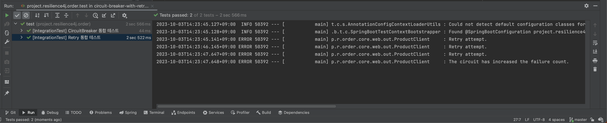

# CircuitBreaker with Retry

[Resilience4j](https://github.com/resilience4j/resilience4j) circuit-breaker with retry practice. If an error occurs
more than a certain number of times after three retries, the circuit opens. `It is important to prevent the Circuit from
counting in case of a retry.`

```java
@Slf4j
@Configuration
public class Resilience4jConfiguration {

    ......

    @Bean
    public CircuitBreaker circuitBreaker(CircuitBreakerRegistry circuitBreakerRegistry) {
        return circuitBreakerRegistry.circuitBreaker(
                PRODUCT_SEARCH_RETRY_CONFIGURATION,
                CircuitBreakerConfig.custom()
                        .recordExceptions(ProductNotFoundException.class)
                        .ignoreExceptions(RetryException.class, BadGatewayException.class)   // ignore
                        
                        ......
        
                        .build()
        );
    }
}
```

<br/><br/><br/><br/>

Circuit and Retry can be implemented in a decorator pattern as follows.

```java
@Slf4j
@Component
@RequiredArgsConstructor
public class ProductClient {

    private final ProductSearchFeignClient productSearchFeignClient;
    private final RetryRegistry retryRegistry;
    private final CircuitBreakerRegistry circuitBreakerRegistry;

    public ProductResponse findProductById(Long productId) {
        Retry retry = retryRegistry.retry(PRODUCT_SEARCH_RETRY_CONFIGURATION);
        CircuitBreaker circuitBreaker = circuitBreakerRegistry.circuitBreaker(PRODUCT_SEARCH_RETRY_CONFIGURATION);

        Supplier<ProductResponse> supplier =
                Retry.decorateSupplier(retry, () -> callAPI(productId));
        supplier = CircuitBreaker.decorateSupplier(circuitBreaker, supplier);

        try {
            return supplier.get();
        // The product module throws a 502 BAD_GATEWAY error under certain conditions, so please check it.
        } catch (BadGatewayException e) {
            log.error("The circuit has increased the failure count.");
            throw new ProductNotFoundException();
        }
    }
    
    ......

}
```

> This can also be implemented through AOP.


<br/><br/><br/><br/><br/><br/>

## Getting Started

Put the application.yml, application-test.yml before running the application.

> You should install jdk 17 or higher. <br/>

<br/><br/><br/>

## Run Test

````text
$ ./gradlew ${MODULE}:test
````

<br/><br/><br/>

## Run Build

````text
$ ./gradlew ${MODULE}:build
````

<br/><br/><br/>

## Result



<br/><br/><br/>

## Env

&nbsp;&nbsp; - Java 17 <br/>
&nbsp;&nbsp; - SpringBoot 3.0 <br/>

