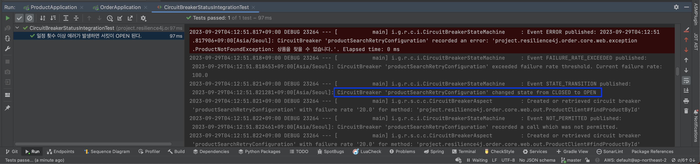

# CircuitBreaker with Spring

[Resilience4j](https://github.com/resilience4j/resilience4j) circuit-breaker practice. If an error occurs more than a certain number of times, circuit is opened.


<br/><br/><br/><br/>


## Getting Started

You must set up application.yml, application-test.yml for each module before running the program.

> You should install jdk 17 or higher. <br/>

<br/><br/><br/>

## Run Test

````text
$ ./gradlew ${MODULE}:test
````

<br/><br/><br/>

## Run Build

````text
$ ./gradlew ${MODULE}:build
````

<br/><br/><br/>

## Result




<br/><br/><br/>

## Env
&nbsp;&nbsp; - Java 17 <br/>
&nbsp;&nbsp; - SpringBoot 3.0 <br/>

