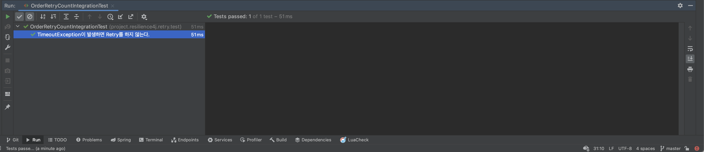

# Retry with Spring

[Resilience4j](https://github.com/resilience4j/resilience4j) retry practice. If an exception occurs during the order
process, try to retry. However, `if a TimeoutException occurs, Retry is not performed.`

<br/><br/><br/><br/>

## Getting Started

You must set up application.yml, application-test.yml for each module before running the program.

> You should install jdk 17 or higher. <br/>

<br/><br/><br/>

## Run Test

````text
$ ./gradlew ${MODULE}:test
````

<br/><br/><br/>

## Run Build

````text
$ ./gradlew ${MODULE}:build
````

<br/><br/><br/>

## Result

If a TimeoutException occurs, it does not try and throws an exception and ends.

````java
@SpringBootTest
@ActiveProfiles("test")
class OrderRetryCountIntegrationTest {

    @SpyBean
    private ProductSearchFeignClient feignClient;

    @Autowired
    private ProductClient productClient;

    @Test
    @DisplayName("TimeoutException이 발생하면 Retry를 하지 않는다.")
    void retry_count_test() {
        Long invalidProductId = Long.MAX_VALUE;

        doThrow(new CompletionException(new TimeoutException()))
                .when(feignClient).findProduct(invalidProductId);

        assertThrows(RequestTimeoutException.class,
                () -> productClient.findProductById(invalidProductId));

        verify(feignClient, times(1))
                .findProduct(invalidProductId);
    }
}
````


<br/><br/><br/>

## Env

&nbsp;&nbsp; - Java 17 <br/>
&nbsp;&nbsp; - SpringBoot 3.0 <br/>

