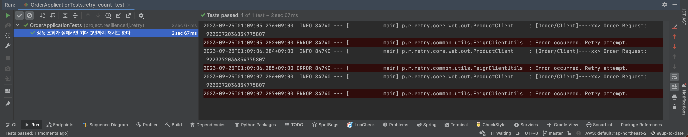

# Retry with Spring

[Resilience4j](https://github.com/resilience4j/resilience4j) retry practice. If an exception occurs during the order process, try to retry.


<br/><br/><br/><br/>


## Getting Started

Make sure to set up ports on each module before starting the project. This is the same when testing.


> You should install jdk 17 or higher. <br/>

<br/><br/><br/>

## Run Test

````text
$ ./gradlew ${MODULE}:test
````

<br/><br/><br/>

## Run Build

````text
$ ./gradlew ${MODULE}:build
````

<br/><br/><br/>

## Result

You can see that the error is resolved after 3 attempts.




<br/><br/><br/>

## Env
&nbsp;&nbsp; - Java 17 <br/>
&nbsp;&nbsp; - SpringBoot 3.0 <br/>

