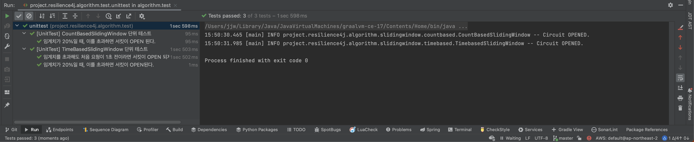

# Resilience4j sliding-window algorithm 

Learning [resilience4j](https://github.com/resilience4j/resilience4j) sliding-window algorithm.

> Multi-thread is not considered.


<br/><br/><br/><br/>


## Getting Started

> You should install jdk 17 or higher. <br/>

<br/><br/><br/>

## Run Test

````text
$ ./gradlew test
````

<br/><br/><br/>

## Run Build

````text
$ ./gradlew build
````

<br/><br/><br/>

## Result




<br/><br/><br/>

## Env
&nbsp;&nbsp; - Java 17 <br/>

